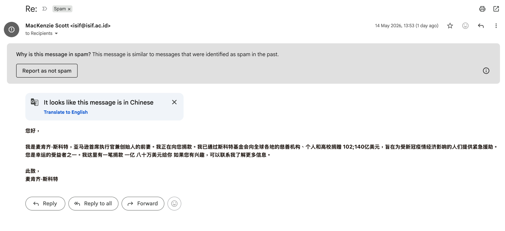

# Phishing Analysis Report — MacKenzie Scott "Charity Donation" Advance-Fee Scam

**Report date:** 2026-05-15

**Analyst:** Security review

**Classification:** Advance-fee fraud (419 / charity-impersonation scam)

**Verdict:** Malicious — confirmed scam


---

## 1. Screen capture



The message was delivered straight to the **Spam** folder. Gmail's banner reads:
*"Why is this message in spam? This message is similar to messages that were identified as spam in the past."*

---

## 2. Summary

A Chinese-language email impersonating philanthropist **MacKenzie Scott** (ex-wife of
Amazon's founder) claims the recipient has been selected to receive a donation of
roughly **US$100.8 million** and invites them to "reply for more information."

This is a textbook **advance-fee fraud**: there is no donation. Victims who reply are
progressively asked for personal data, banking details, and "processing / transfer /
legal fees" that are pocketed by the fraudster. The MacKenzie Scott name has been
abused for this scam since ~2021 and is documented by CBS News, Bitdefender, the U.S.
HHS HC3, and others.

The notable technical feature of this sample is that **all email authentication
(SPF, DKIM, DMARC) PASSED**. This is not because the mail is legitimate — it is
because the message was sent through the **genuine mail server of a real
Indonesian university (`isif.ac.id`) using a compromised / abused mailbox**.

---

## 3. Message metadata

| Field | Value |
|---|---|
| Displayed sender | `MacKenzie Scott <isif@isif.ac.id>` |
| Envelope From / Return-Path | `isif@isif.ac.id` |
| **Reply-To** | **`mackenziesctt@tutamail.com`** ← attacker's real inbox |
| To | `Recipients <isif@isif.ac.id>` (real victims BCC'd — bulk mailing) |
| Subject | `Re:` (empty subject, fake reply prefix) |
| Date header | Wed, 13 May 2026 18:28:26 -0700 |
| Delivered to | `hopolun@gmail.com` |
| Body language | Chinese (Simplified); Gmail offered "Translate to English" |
| Spam status | `X-Spam: Yes` — flagged even by the sending server |

### Translated body
> Hello,
> I am MacKenzie Scott, ex-wife of the founder and CEO of Amazon. I am making a
> donation to you. I have donated [garbled] billion USD through the Scott Foundation
> to charities, individuals and universities worldwide, to provide emergency relief
> to people economically affected by COVID-19. You are one of the lucky beneficiaries.
> I have a donation of 100.8 million dollars for you. If you are interested, contact
> me for more information.
> Sincerely, MacKenzie Scott

---

## 4. OSINT findings

### 4.1 Sending domain — `isif.ac.id`
- **ISIF = Institut Studi Islam Fahmina**, an Islamic higher-education institution in
  **Cirebon, Indonesia** (`.ac.id` = Indonesian academic domain). Founded 2007.
- `isif@isif.ac.id` is the institution's **real published contact address**
  (listed on their public "Kontak" page).
- This is a **legitimate, otherwise-trustworthy organisation** — its mailbox or SMTP
  credentials have been **compromised or abused** to send the scam. The institution
  itself is a victim, not the perpetrator.

### 4.2 Mail server — `mail.isif.ac.id` → `160.250.227.30`
- Location: **Cikarang, West Java, Indonesia**
- Operator: **PT Detroit Network Indonesia** (AS135659, `detnet.id`)
- This is the institution's genuine hosting provider — consistent with a real,
  not spoofed, server.

### 4.3 Originating client — `103.87.68.59`
- `Received: from DONROLOP7213.localdomain (unknown [103.87.68.59])`
- Location: **Jakarta, Indonesia**
- Operator: **PT Atharva Telematika Persada** (AS150249)
- **Flagged as a VPN / anonymising IP.**
- `DONROLOP7213.localdomain` is a generic Windows-style hostname with **no valid
  reverse DNS** (`unknown`) — i.e., the attacker's own machine connecting through a VPN.
- The connection used **`ESMTPSA`** (authenticated SMTP) — the attacker **logged in
  with valid account credentials**, which is why authentication passed downstream.

### 4.4 Reply-To — `mackenziesctt@tutamail.com`
- **`tutamail.com`** is Tutanota/Tuta, a free, anonymous, German privacy-focused
  encrypted-mail provider — heavily favoured by scammers because it requires no
  identity verification.
- Note the typo-style handle `mackenziesctt` ("sctt" — vowels dropped) crafted to
  look like "MacKenzie Scott" while being a throwaway account.
- **All replies route here, NOT to the university.** This is the scammer's collection
  inbox and the single clearest indicator of intent.

---

## 5. Why authentication "passed" (and why it doesn't matter)

```
spf=pass     (160.250.227.30 is a permitted sender for isif.ac.id)
dkim=pass    (header.i=@isif.ac.id, signed by the real server)
dmarc=pass   (p=QUARANTINE, alignment OK)
```

SPF/DKIM/DMARC only prove the message **really left the `isif.ac.id` infrastructure**.
They say **nothing about whether the content or human intent is honest**. Here the
attacker did not spoof the domain — they **sent through it with stolen/abused
credentials**, so every check legitimately passes. Authentication is a sender-identity
control, not a fraud control.

---

## 6. Indicators of phishing / fraud

| # | Indicator | Detail |
|---|---|---|
| 1 | **Reply-To mismatch** | Sender `isif@isif.ac.id` but replies go to `mackenziesctt@tutamail.com` |
| 2 | **Unsolicited windfall** | ~US$100.8 million "donation" to a stranger — too good to be true |
| 3 | **Celebrity impersonation** | Well-documented MacKenzie Scott scam template |
| 4 | **Identity / context mismatch** | A US billionaire "donating" via an Indonesian Islamic university mailbox |
| 5 | **Empty `Re:` subject** | Fake reply prefix to imply prior correspondence |
| 6 | **Bulk distribution** | `To:` is the sender itself; real recipients BCC'd |
| 7 | **Missing Message-ID** | `SMTPIN_ADDED_MISSING` — Google had to generate one; the original had none, typical of bulk-mailer scripts |
| 8 | **Anonymous Reply-To provider** | tutamail.com — anonymous encrypted mail |
| 9 | **VPN-origin authenticated login** | Sent from a VPN IP unrelated to the institution |
| 10 | **Corrupted encoding** | The plain-text MIME part is garbled — hallmark of a script-generated message |
| 11 | **Pandemic / charity pretext** | "COVID-19 emergency relief" emotional hook |
| 12 | **Server-side spam flag** | `X-Spam: Yes` and Gmail spam placement |

---

## 7. Indicators of Compromise (IOCs)

| Type | Value |
|---|---|
| Reply-To address | `mackenziesctt@tutamail.com` |
| Abused sender mailbox | `isif@isif.ac.id` |
| Originating IP (VPN) | `103.87.68.59` (AS150249, Jakarta, ID) |
| Sending mail server | `160.250.227.30` / `mail.isif.ac.id` (AS135659) |
| Attacker hostname | `DONROLOP7213.localdomain` |
| Message-ID | `<6a05c5bb.4e269173.e72ff.e6aeSMTPIN_ADDED_MISSING@mx.google.com>` |
| Subject | `Re:` (empty) |
| Lure theme | MacKenzie Scott / Scott Foundation charity donation |

---

## 8. Threat assessment

- **Scam type:** Advance-fee fraud (419). Expect follow-up requests for ID documents,
  bank/wallet details, and upfront "processing / transfer / tax / legal" fees.
- **Sophistication:** Low technical sophistication, but **above-average deliverability**
  because it rides on a real, authenticated academic domain — it will defeat naive
  "check SPF/DKIM" advice and may bypass some filters.
- **Targeting:** Untargeted bulk spam (recipients BCC'd). Not spear-phishing.
- **Direct payload:** None — no links or attachments in this sample. Harm is purely
  social-engineering / financial once the victim replies.

---

## 9. Recommended actions

**For the recipient**
1. **Do not reply, do not contact `mackenziesctt@tutamail.com`, do not send money or
   personal/banking information.**
2. Keep it in Spam or delete it; in Gmail use **Report spam / Report phishing**.
3. Never "report as not spam" — the Gmail placement is correct.

**For mail administrators**
4. Block / quarantine sender `mackenziesctt@tutamail.com` and the lure subject pattern.
5. Treat authentication results with care: SPF/DKIM/DMARC pass does **not** clear a
   message — inspect **Reply-To ≠ From** mismatches and known scam templates.
6. Consider flagging mail where Reply-To uses anonymous providers (tutamail.com etc.)
   and the From domain differs.

**Responsible disclosure**
7. Notify **ISIF (Institut Studi Islam Fahmina, `isif.ac.id`)** that their
   `isif@isif.ac.id` mailbox / SMTP credentials appear compromised and are being used
   to send fraud. Recommended remediation for them: reset the account password,
   enforce MFA, review SMTP/webmail login logs for `103.87.68.59`, and check for
   mailbox forwarding rules.

---

## 10. References
- [CBS News — MacKenzie Scott scam: fake donations in billionaire's name](https://www.cbsnews.com/news/mackenzie-scott-scam-charity-fake-donations/)
- [Bitdefender — Spammers impersonate MacKenzie Scott in giveaway scam campaign](https://www.bitdefender.com/en-us/blog/hotforsecurity/spammers-impersonate-billionaire-mackenzie-scott-in-new-giveaway-scam-campaign)
- [U.S. HHS HC3 — Grant Donation Email Scam sector alert](https://www.hhs.gov/sites/default/files/grant-donation-scam-sector-alert.pdf)
- [PCrisk — Mackenzie Scott Foundation Email Scam](https://www.pcrisk.com/removal-guides/27554-mackenzie-scott-foundation-email-scam)
- [ISIF — Institut Studi Islam Fahmina (official site)](https://isif.ac.id/)
